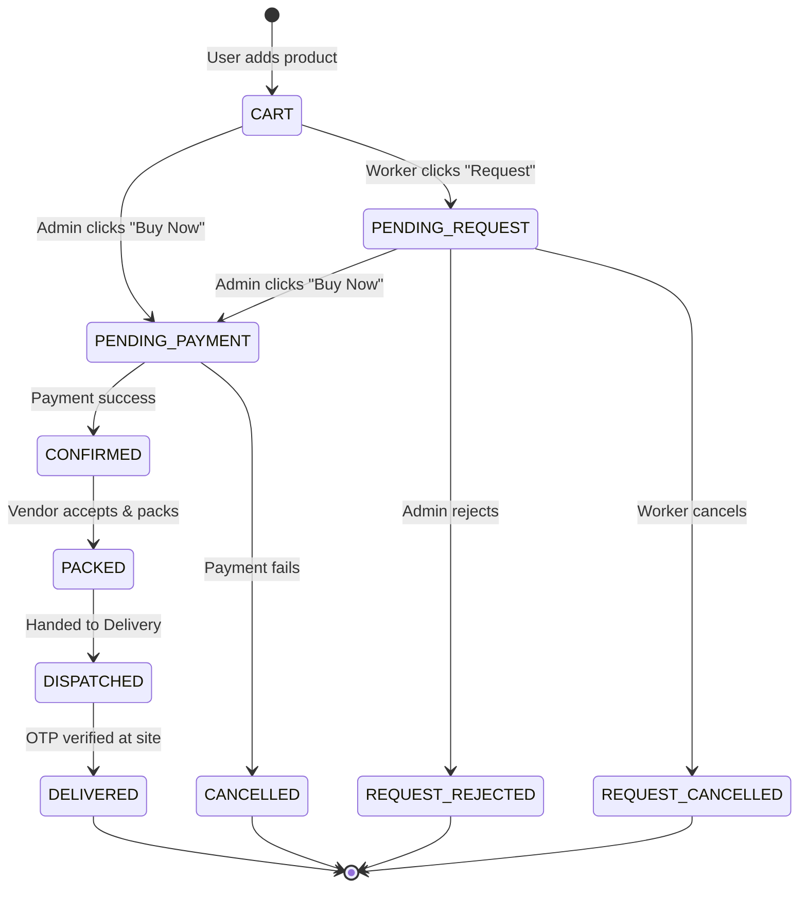
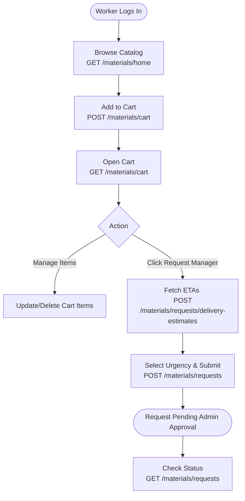
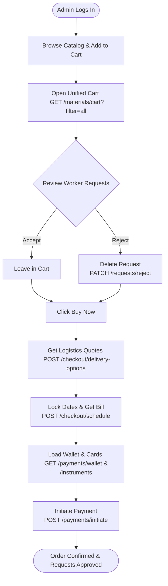
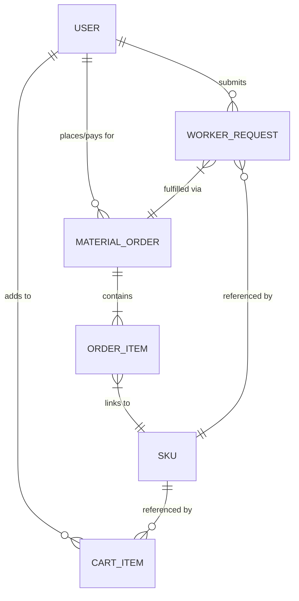
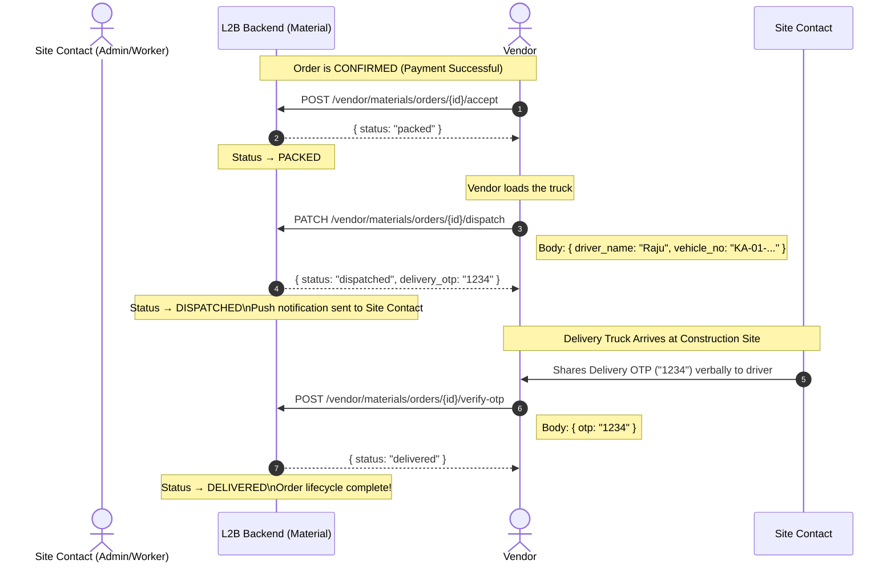

# L2B Material — Complete API Flow Documentation

### Overview
This document serves as the master backend architecture and API blueprint for the L2B (Link2Build) Material procurement module. It is designed to support a scalable, enterprise-grade B2B e-commerce flow, featuring strict role-based access control and procurement logic. 

**Key Architectural Highlights:**
* **B2B Procurement Workflow:** Separates purchasing power. Site Workers build carts and generate "Requests" for materials, while Admins aggregate those requests, finalize delivery logistics, and execute payments.
* **Unified Global Services:** Leverages cross-module architecture by sharing User Profile, Wallet, and Payment endpoints with the L2B Rental module, ensuring a seamless, native checkout experience across the entire platform.
* **End-to-End Lifecycle Tracking:** Maps the entire state of an order from an active cart session, through secure bank gateways, down to the final OTP verification by the delivery truck at the construction site.

**What This Document Contains:**
1. **State Machine:** The complete status lifecycle of a material order.
2. **Role-Based Flowcharts:** UI-to-API journey maps tailored specifically for the Worker and Admin flows.
3. **Database Architecture (ERD):** The core entity relationships linking Users, SKUs, and Orders.
4. **Vendor Fulfillment Sequence:** The post-payment dispatch and delivery verification logic.
5. **Complete API Reference:** A comprehensive, endpoint-by-endpoint backend contract detailing HTTP methods, parameters, and authentication rules.

> **Base URL:** `/api/v1`

---

## 1. Material Order Lifecycle (State Machine)

---

## 2. Role-Based Flowcharts

### A. The Worker Flow (Request Generation)

### B. The Admin Flow (Procurement & Checkout)

## 2.1. Core Database Architecture (ERD)

---
## 2.2. Material Delivery & Verification Flow

---
## 3. Complete API Reference

### Catalog & Discovery (Shared)
| Method | Endpoint | Description | Auth |
|--------|----------|-------------|------|
| GET | `/materials/home` | Aggregated home feed. | ❌ none |
| GET | `/materials/categories` | List of all material parent categories. | ❌ none |
| GET | `/materials/products/{slug}` | Base product details. | ❌ none |
| GET | `/materials/products/{slug}/variants` | Returns hierarchical types (Red Clay) and SKUs (9x4x3) in nested call. | ❌ none |
| GET | `/materials/skus/{slug}` | Full SKU details (desc, specifications, base price). | ❌ none |
| GET | `/materials/skus/{slug}/reviews` | Paginated endpoint to fetch individual user text reviews. | ❌ none |
| GET | `/materials/skus/{slug}/related` | Cross-sell engine. Returns complementary SKUs. | ❌ none |
| GET | `/materials/skus/{slug}/brands` | Returns list of vendors selling this SKU, with brand-specific price and live stock. | ❌ none |
| GET | `/materials/search` | Global material search. | ❌ none |

### Wishlist Management
| Method | Endpoint | Description | Auth |
|--------|----------|-------------|------|
| GET | `/materials/wishlist` | Fetches user's saved wishlist items. | ✅ real |
| POST | `/materials/wishlist/{slug}` | Adds a SKU to the wishlist. | ✅ real |
| DELETE | `/materials/wishlist/{slug}` | Removes a SKU from the wishlist. | ✅ real |

### Cart Management (Shared)
| Method | Endpoint | Description | Auth |
|--------|----------|-------------|------|
| GET | `/materials/cart` | **Role-Based:** Workers see their items. Admins see own items + Pending Requests. | ✅ real |
| POST | `/materials/cart` | Add items to cart. Validates stock and delivery radius. Auto-assigns cheapest vendor if bundled. | ✅ real |
| PATCH | `/materials/cart/{id}` | Update quantity in cart. Re-validates stock against vendor inventory. | ✅ real |
| DELETE | `/materials/cart/{id}` | Remove item from cart. | ✅ real |

### Procurement Workflow (Worker -> Admin Approvals)
| Method | Endpoint | Description | Auth |
|--------|----------|-------------|------|
| POST | `/materials/requests/delivery-estimates` | **Worker Only:** Fetches ETAs (without pricing) to populate the "Request Slot" modal. | ✅ real (worker) |
| POST | `/materials/requests` | **Worker Only:** Converts cart items into organizational requests. Accepts `delivery_type` flag (urgent/normal). | ✅ real (worker) |
| GET | `/materials/requests` | **Role-Based:** Workers view their own requests. Admins view organizational request history. | ✅ real |
| PATCH | `/materials/requests/{id}/cancel` | **Worker Only:** Cancels a request before Admin approval. | ✅ real (worker) |
| PATCH | `/materials/requests/{id}/reject` | **Admin Only:** Rejects a worker request (fired from cart trash icon). | ✅ real (admin) |

### Material Logistics & Checkout (Admin Only)
| Method | Endpoint | Description | Auth |
|--------|----------|-------------|------|
| GET | `/materials/coupons` | Fetch available cashback offers and discounts to display in UI. | ✅ real (admin) |
| POST | `/materials/checkout/delivery-options` | Calculates dynamic logistics fees (e.g., Fast ₹100 Extra) and checks for stock warnings on future dates. | ✅ real (admin) |
| POST | `/materials/checkout/schedule` | Locks delivery dates/fees. Generates `checkout_session_id` and final bill math. | ✅ real (admin) |

### Order Management & Tracking
| Method | Endpoint | Description | Auth |
|--------|----------|-------------|------|
| GET | `/materials/orders` | Fetches order history (for "Track your orders >>"). | ✅ real |
| GET | `/materials/orders/{id}` | Fetches specific order details and current tracking status. | ✅ real |

### Shared User Services (Profile & Payments)
*These endpoints live in the global user/payment modules and serve both Rental and Material.*

| Method | Endpoint | Description | Auth |
|--------|----------|-------------|------|
| GET | `/users/sites` | **Universal:** Fetches user's/organization's saved delivery sites (for "Change site" modal). | ✅ real |
| GET | `/payments/wallet` | **Universal:** Fetches the common Wallet and Cashback balance. | ✅ real |
| POST | `/payments/wallet/topup` | **Universal:** Add money to the common organizational wallet. | ✅ real |
| POST | `/payments/coupons/validate` | **Universal:** Validates a coupon code and returns the discount math. | ✅ real |
| GET | `/payments/instruments` | **NEW (For Native UI):** Fetches user's saved ICICI Card, PayPal, Cred, and UPI IDs. | ✅ real |
| POST | `/payments/instruments` | **NEW (For Native UI):** Securely saves a new card or UPI ID for future 1-click checkout as a token. | ✅ real |
| POST | `/payments/initiate` | **Universal:** Processes the final payment payload (handles Wallet deduction, saved cards, or redirects to gateway). | ✅ real |

### Notifications
| Method | Endpoint | Description | Auth |
|--------|----------|-------------|------|
| GET | `/notifications/unread-count` | Lightweight count for the UI bell icon. | ✅ real |
| POST | `/materials/restock-alerts` | Subscribes user to a push notification for out-of-stock items. | ✅ real |

> **Auth legend:**
> - ✅ real — Requires valid JWT (encoded with userId and role)
> - ❌ none — Publicly accessible