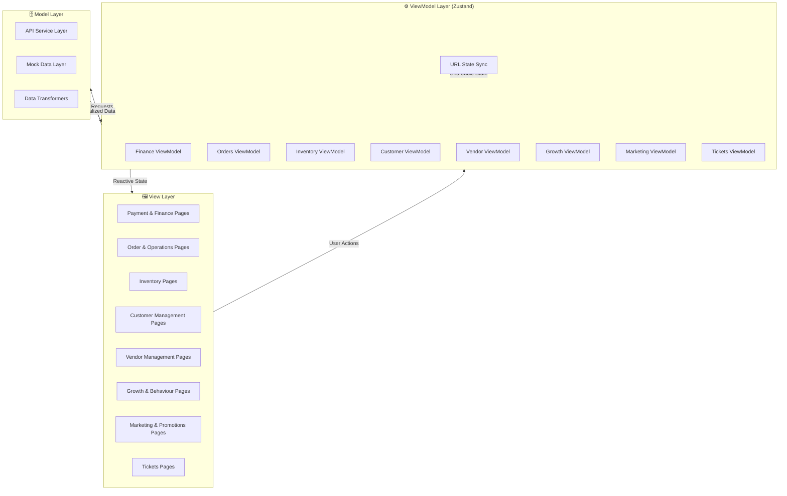
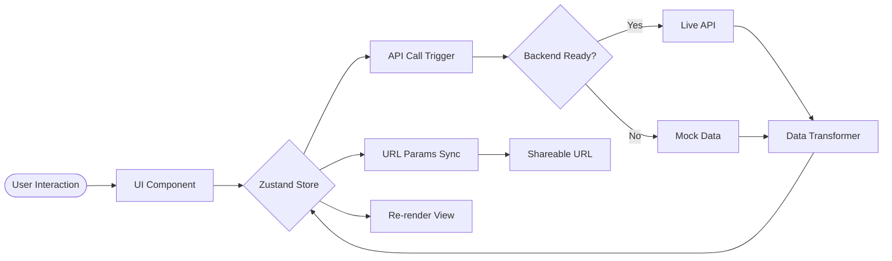
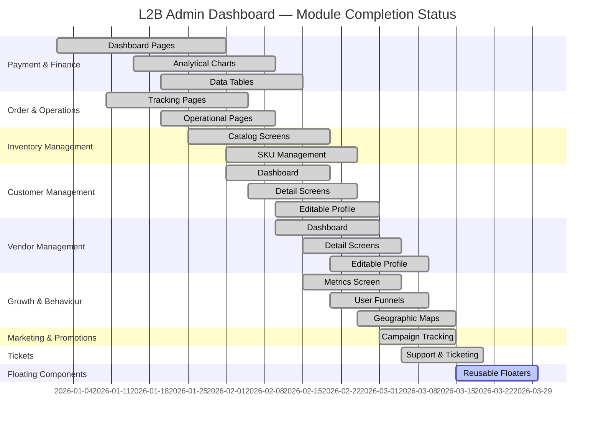
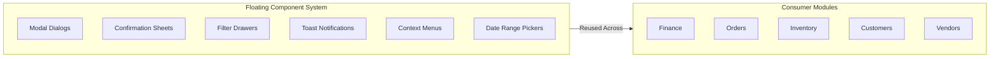
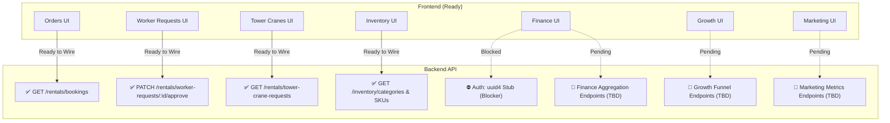
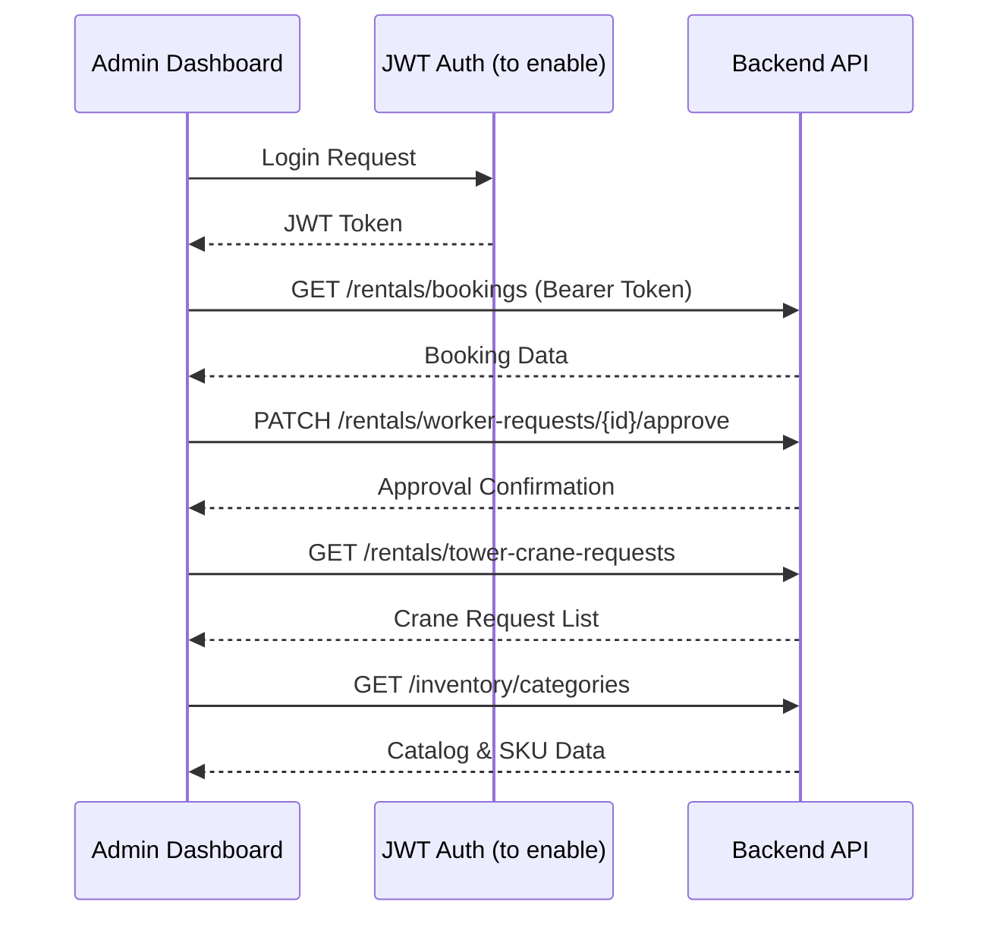
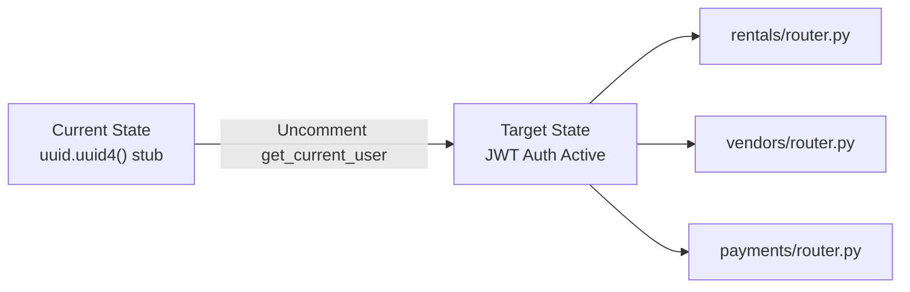
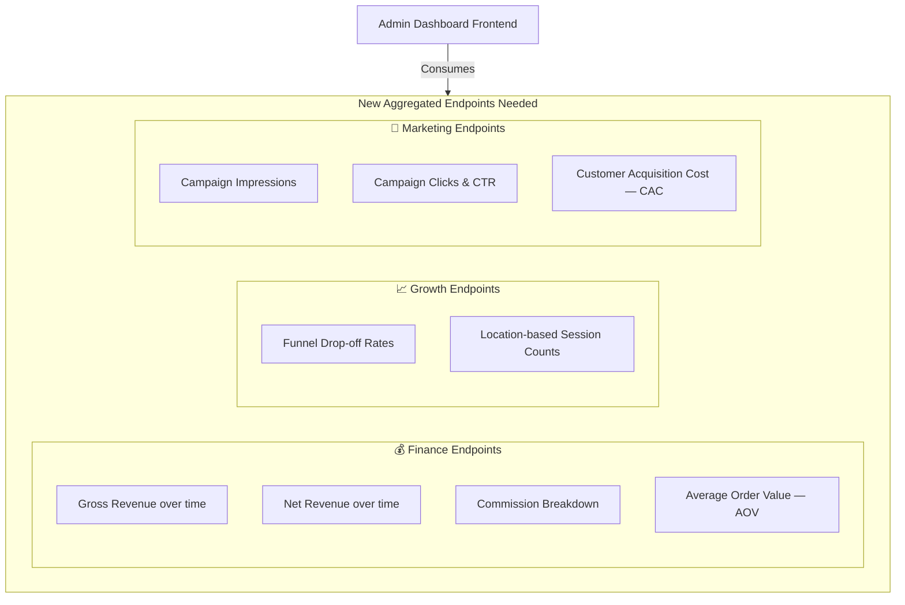
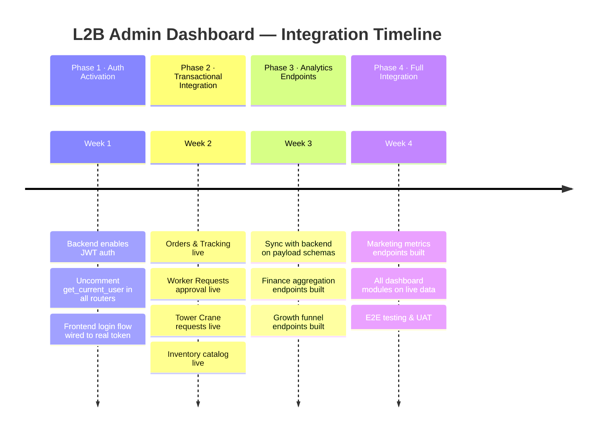
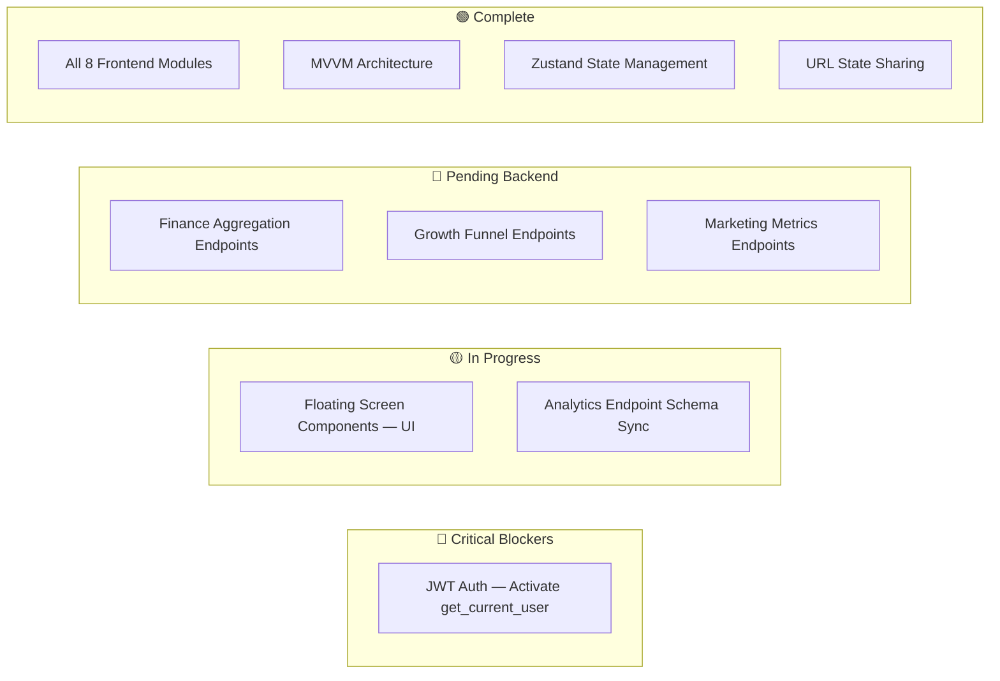

# L2B Admin Dashboard — Frontend Architecture & API Integration Report

**Date:** March 25, 2026
**Subject:** Frontend Architecture Finalization and API Integration Next Steps

---

## Executive Summary

The core UI development and architectural foundation for the **L2B Admin Dashboard** are successfully established. The application is built on a highly scalable, enterprise-grade **MVVM (Model-View-ViewModel)** architecture that:

- Completely decouples UI from business logic
- Ensures efficient state management via **Zustand**
- Makes all complex dashboard states (tabs, date ranges, filters) shareable via **URL parameters**

The frontend is now in a strong, stable position and is ready to begin mapping to live backend services.

---

## 1. Architecture Overview

### 1.1 MVVM Pattern



### 1.2 State Management Flow



---

## 2. Frontend Milestones Achieved

All modules below are **fully built, styled, and wired** to the MVVM architecture using mock data — 100% ready for API integration.



### 2.1 Module Summary

| Module | Pages Built | Charts | Tables | Status |
|---|---|---|---|---|
| Payment & Finance | ✅ | ✅ | ✅ | Mock Ready |
| Order & Operations | ✅ | ✅ | ✅ | Mock Ready |
| Inventory Management | ✅ | ✅ | ✅ | Mock Ready |
| Customer Management | ✅ | ✅ | ✅ | Mock Ready |
| Vendor Management | ✅ | ✅ | ✅ | Mock Ready |
| Growth & Behaviour | ✅ | ✅ | ✅ | Mock Ready |
| Marketing & Promotions | ✅ | ✅ | ✅ | Mock Ready |
| Tickets | ✅ | ✅ | ✅ | Mock Ready |
| **Floating Components** | 🔄 | — | — | **In Progress** |

---

## 3. Current UI Focus

### 3.1 Floating Screen Components

Finalizing reusable floating components to ensure they are **standardized across the application**.



---

## 4. Backend API Readiness & Integration Plan

### 4.1 Current Integration Landscape



### 4.2 Section A — Ready for Immediate Integration

Once authentication is activated, the following can be integrated immediately:



| Endpoint | Method | Feature | Status |
|---|---|---|---|
| `/rentals/bookings` | `GET` | Orders & Tracking | ✅ Ready |
| `/rentals/worker-requests/{id}/approve` | `PATCH` | Worker Approval Flow | ✅ Ready |
| `/rentals/tower-crane-requests` | `GET` | Tower Crane Review | ✅ Ready |
| `/inventory/categories` | `GET` | Catalog & SKUs | ✅ Ready |

---

## 5. Action Items for Backend Team

### 5.1 Critical Blocker — Activate JWT Authentication

> ⚠️ **Priority: CRITICAL** — Blocks all secure admin data scoping

The backend rental, vendor, and payment endpoints currently use a **stubbed authentication method** (`uuid.uuid4()`). To enable secure admin login and correct data scoping, the backend team must:



**Action Required:**
- Uncomment `get_current_user` across all router files:
  - `rentals/router.py`
  - `vendors/router.py`
  - `payments/router.py`

---

### 5.2 New Dashboard Analytics Endpoints Required

The existing API covers **transactional flows** for User and Vendor mobile apps. To power the Admin Dashboard, **new aggregated analytics endpoints** are needed.



#### Proposed Payload Structure

**Finance — Aggregated Revenue**
```json
{
  "period": "2026-03",
  "gross_revenue": 980000,
  "net_revenue": 712000,
  "commission": 268000,
  "aov": 4350,
  "trend": [
    { "date": "2026-03-01", "gross": 32000, "net": 23000 }
  ]
}
```

**Growth — Funnel Drop-off**
```json
{
  "funnel": [
    { "stage": "Landing", "users": 12000 },
    { "stage": "Product View", "users": 8400 },
    { "stage": "Add to Cart", "users": 5200 },
    { "stage": "Checkout", "users": 3100 },
    { "stage": "Confirmed", "users": 2600 }
  ],
  "geo_sessions": [
    { "location": "Mumbai", "lat": 19.076, "lng": 72.877, "sessions": 4200 }
  ]
}
```

**Marketing — Campaign Metrics**
```json
{
  "campaign_id": "CAMP-042",
  "name": "Monsoon Promo",
  "impressions": 120000,
  "clicks": 8400,
  "ctr": 0.07,
  "cac": 320
}
```

---

## 6. Integration Roadmap



---

## 7. Summary of Open Items



| # | Item | Owner | Priority | Status |
|---|---|---|---|---|
| 1 | Activate JWT Auth (`get_current_user`) | Backend | 🔴 Critical | Blocked |
| 2 | Finalize Floating Components | Frontend | 🟡 Medium | In Progress |
| 3 | Analytics Endpoint Schema Sync | Both | 🟡 Medium | Pending Sync |
| 4 | Finance Aggregation Endpoints | Backend | 🔵 High | Not Started |
| 5 | Growth Funnel Endpoints | Backend | 🔵 High | Not Started |
| 6 | Marketing Metrics Endpoints | Backend | 🔵 Medium | Not Started |
| 7 | Wire transactional endpoints post-auth | Frontend | 🟢 Ready | Queued |

---

*Document generated: March 25, 2026 · L2B Engineering Team*