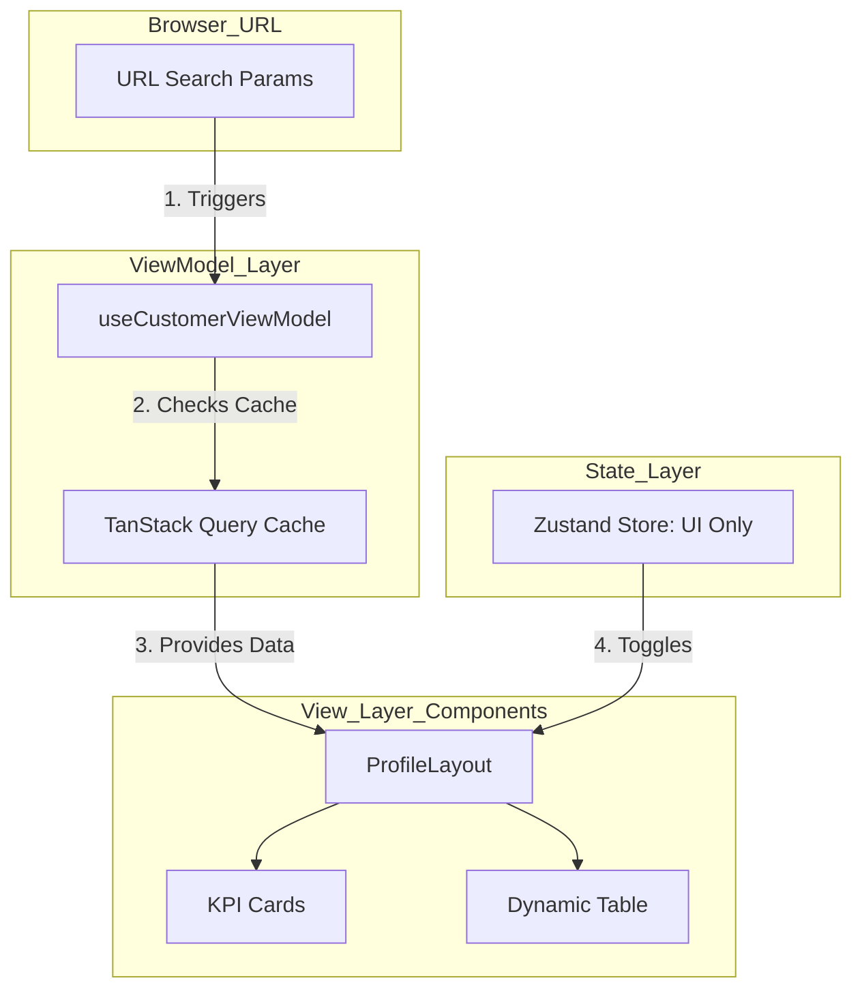

# 📄 L2B Dashboard: Hybrid State Architecture Plan

**Target Implementation Date:** Saturday  
**Lead Architect:** Gemini (AI Senior Frontend Dev)  
**Project:** Link2Build (L2B) Customer Management Feature

---

## 1. Executive Summary: The "Why"

We are moving away from a **Monolithic State** (putting everything in one place) to a **Tripartite (3-Pillar) Hybrid Approach**.

| Pillar | Responsibility | Tool | Benefit |
| :--- | :--- | :--- | :--- |
| **URL State** | Dashboard Filters (Dates, Toggles, Search) | Next.js `useSearchParams` | Sharable links, bookmarking, and SEO. |
| **Server State** | API Data (Tables, Charts, KPIs) | TanStack Query (React Query) | Auto-caching, loading states, and background updates. |
| **UI State** | Ephemeral Toggles (Modals, Drawers) | Zustand / Local `useState` | High performance, zero re-render lag. |

### Why this fits L2B

1. **B2B Requirement:** Managers need to share specific filtered views (URL State).
2. **Performance:** Dashboards with many charts/tables get laggy if global state is used for everything.
3. **Architecture Match:** This perfectly fits your existing MVVM + Feature-Sliced folder structure.

---

## 2. Architecture Diagram



---

## 3. Pre-Implementation Checklist

Before we start on Saturday, ensure the following:

1. **Code Cleanup:** Ensure `ProfileLayout.tsx` is "Dumb" (it should only receive props, no hardcoded data inside). ✅ `[COMPLETED]`
2. **Mock Data Isolation:** Move all your large arrays into a dedicated `mockData.ts` file to keep the ViewModel clean.
3. **Dependency Installation:**

```bash
npm install @tanstack/react-query zustand lucide-react
```

---

## 4. The 5-Step Implementation Plan

### Step 1: The Provider Setup

Wrap the application in the `QueryClientProvider`. This enables the "Server State" caching layer.

### Step 2: The UI Store (Zustand)

Create `features/customermanagement/state/useCustomerUIStore.ts`. We will move the "Order Drawer" and "Filter Modal" logic here to decouple it from the main data flow.

### Step 3: The Hybrid ViewModel

Create `features/customermanagement/viewModel/useCustomerViewModel.ts`.

- It will read the URL parameters.
- It will use `useQuery` to fetch data based on those parameters.
- It will return `data`, `isLoading`, and `error`.

### Step 4: URL Syncing

Modify the `TableToolbar` and `Header` filters. Instead of calling `setFilter(val)`, they will now call `router.push('?filter=val')`. This makes the URL the **"Source of Truth."**

### Step 5: Screen Integration

Update `CustomerManagementPage.tsx` (the Screen) to connect the ViewModel to the `ProfileLayout`.

---

## 5. Potential Edge Cases & Mitigations

- **Edge Case:** User refreshes the page while a Drawer is open.
  - **Fix:** If the Drawer is important, we move its ID to the URL. If it's temporary, Zustand handles the reset gracefully.

- **Edge Case:** Backend API format changes.
  - **Fix:** We use the **Adapter Pattern (Mapper)** inside the ViewModel to transform backend keys to our UI keys.

---

## 6. Saturday's Definition of Done (DoD)

- [ ] Dashboard filters (Rental/Material) update the URL.
- [ ] Refreshing the page keeps the filters active.
- [ ] Data is fetched via React Query (using mock fetch for now).
- [ ] Component re-renders are minimized (`ProfileLayout` only re-renders when data actually changes).

---

---

## 7. Technical Contracts (Types & Adapter)

To ensure the **Adapter Pattern** discussed in Section 5 is implemented correctly, we will use the following TypeScript contracts.

### 7.1 Data Interfaces
```typescript
// The "Clean" data our UI Components expect
export interface CustomerInfo {
  name: string;
  contactNo: string;
  referralNo: string;
  email: string;
  idLabel: string;
  idValue: string;
}

export interface TeamMember {
  name: string;
  id: string;
  associatedSite: string;
  status: "assigned" | "unassigned";
}

export interface ProjectDetails {
  siteName: string;
  address: string;
  teamMembers: number;
  receiverName: string;
  status: "assigned" | "unassigned";
}


export const mapProfileData = (rawApiData: any): ProfileScreenProps => {
  return {
    role: rawApiData.user_role, // Maintains Role-Based Visibility Logic
    customerData: {
      name: rawApiData.profile.full_name,
      contactNo: rawApiData.profile.phone_number,
      email: rawApiData.profile.email_address,
      referralNo: rawApiData.profile.referral_code || "#N/A",
      idLabel: "Customer ID",
      idValue: rawApiData.profile.unique_id,
    },
    teamTableData: rawApiData.team_members.map((emp: any) => ({
      name: emp.emp_name,
      id: emp.emp_id,
      associatedSite: emp.current_site || "-",
      status: emp.is_active_on_site ? "assigned" : "unassigned"
    })),
    // ... additional mapping for projects and payments
  };
};


### Why put it here?
* **Centralization:** All "brain" logic is in one document.
* **Synchronization:** It explicitly links the **Role-Based Visibility** we discussed to the new **Hybrid State** model.
* **Implementation Speed:** On Saturday, we can literally copy-paste these into your `types/profile.ts` and `viewModel/` files in seconds.

You're all set! Your L2B architecture is now fully documented and ready for production-grade implementation.

Would you like me to generate that `mockData.ts` file now so your API simulation is ready for the weekend?


> 💡 **On Saturday**, simply upload this file and say: *"Gemini, let's implement the Hybrid State Plan."* Context will be immediately recognized and coding can begin at Step 1.